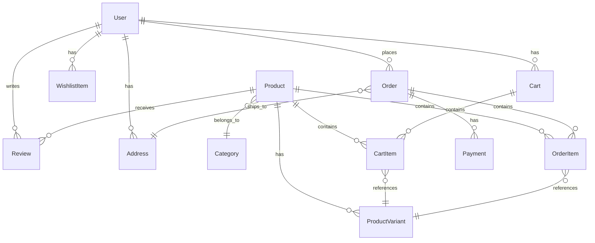

# QuoriumAgro - Architecture Documentation

## System Architecture

```
┌─────────────────────────────────────────────────────────────────┐
│                         Client Layer                             │
├──────────────┬──────────────┬──────────────┬────────────────────┤
│   iOS App    │  Android App │   Web App    │   Admin Dashboard  │
│   (Expo)     │   (Expo)     │  (Next.js)   │    (Next.js)       │
└──────────────┴──────────────┴──────────────┴────────────────────┘
                              │
                              ▼
┌─────────────────────────────────────────────────────────────────┐
│                         API Gateway                              │
│                      (NestJS REST API)                           │
│  ┌──────────┬──────────┬──────────┬──────────┬──────────────┐  │
│  │   Auth   │ Products │   Cart   │  Orders  │   Payments   │  │
│  └──────────┴──────────┴──────────┴──────────┴──────────────┘  │
└─────────────────────────────────────────────────────────────────┘
                              │
        ┌─────────────────────┼─────────────────────┐
        ▼                     ▼                     ▼
┌──────────────┐    ┌──────────────┐    ┌──────────────┐
│  PostgreSQL  │    │    Redis     │    │ Meilisearch  │
│  (Database)  │    │   (Cache)    │    │   (Search)   │
└──────────────┘    └──────────────┘    └──────────────┘
                              │
        ┌─────────────────────┼─────────────────────┐
        ▼                     ▼                     ▼
┌──────────────┐    ┌──────────────┐    ┌──────────────┐
│   AWS S3     │    │    Stripe    │    │  Razorpay    │
│  (Storage)   │    │  (Payments)  │    │  (Payments)  │
└──────────────┘    └──────────────┘    └──────────────┘
```

## Technology Stack

### Frontend

#### Mobile (React Native + Expo)
- **Framework**: React Native 0.73
- **Router**: Expo Router (file-based routing)
- **Styling**: NativeWind (Tailwind for React Native)
- **State Management**: 
  - Zustand (UI state)
  - React Query (server state)
- **Forms**: React Hook Form + Zod validation
- **Storage**: Expo SecureStore
- **Images**: Expo Image (optimized)
- **Navigation**: React Navigation (via Expo Router)

#### Web (Next.js)
- **Framework**: Next.js 14 (App Router)
- **Styling**: Tailwind CSS
- **State Management**:
  - Zustand (UI state)
  - React Query (server state)
- **Forms**: React Hook Form + Zod validation
- **Images**: Next.js Image (optimized)
- **Icons**: Lucide React

### Backend

#### API (NestJS)
- **Framework**: NestJS 10
- **Language**: TypeScript
- **ORM**: Prisma
- **Authentication**: JWT + Passport
- **Validation**: class-validator + class-transformer
- **Documentation**: Swagger/OpenAPI
- **Logging**: Pino
- **Security**: Helmet, CORS, Rate Limiting

### Database & Storage

- **Database**: PostgreSQL 16
- **ORM**: Prisma
- **Cache**: Redis 7
- **Search**: Meilisearch
- **Storage**: AWS S3 / MinIO (local)

### External Services

- **Payments**: Stripe, Razorpay
- **Email**: Resend / Nodemailer
- **SMS**: Twilio (optional)
- **Push Notifications**: Firebase Cloud Messaging
- **Error Tracking**: Sentry (optional)

### DevOps

- **Monorepo**: Turborepo
- **Package Manager**: pnpm
- **Containerization**: Docker + Docker Compose
- **CI/CD**: GitHub Actions
- **Hosting**: 
  - API: Railway / Render / Fly.io
  - Web: Vercel
  - Mobile: EAS Build + App Stores

## Data Models

### Core Entities



### Key Models

**User**
- Authentication & profile data
- Roles: CUSTOMER, ADMIN, MANAGER, SUPPORT
- OAuth support (Google, Apple)

**Product**
- Core product information
- Multiple variants (size, weight, etc.)
- Images, tags, care instructions
- Medicinal plant flags
- Sunlight/water requirements

**Order**
- Order lifecycle management
- Status: PENDING → PAID → PROCESSING → PACKED → SHIPPED → DELIVERED
- Payment integration
- Invoice generation

**Cart**
- Session-based for guests
- Persistent for logged-in users
- Auto-calculation of totals, tax, discounts

## API Architecture

### Layered Architecture

```
┌─────────────────────────────────────┐
│         Controllers                 │  ← HTTP Layer
│  (Request/Response handling)        │
├─────────────────────────────────────┤
│          Services                   │  ← Business Logic
│  (Core application logic)           │
├─────────────────────────────────────┤
│        Repositories                 │  ← Data Access
│  (Prisma ORM)                       │
├─────────────────────────────────────┤
│         Database                    │  ← Persistence
│  (PostgreSQL)                       │
└─────────────────────────────────────┘
```

### Module Structure

```
apps/api/src/
├── auth/                 # Authentication & authorization
│   ├── strategies/       # Passport strategies (JWT, Google)
│   ├── guards/           # Auth guards
│   └── decorators/       # Custom decorators
├── users/                # User management
├── products/             # Product catalog
├── categories/           # Product categories
├── cart/                 # Shopping cart
├── orders/               # Order management
├── payments/             # Payment processing
├── reviews/              # Product reviews
├── wishlist/             # User wishlist
├── admin/                # Admin operations
├── storage/              # File storage (S3/MinIO)
├── search/               # Search (Meilisearch)
├── notifications/        # Push notifications
└── prisma/               # Database client
```

### Authentication Flow

```
1. User Registration/Login
   ↓
2. Generate JWT Access Token (15min) + Refresh Token (7d)
   ↓
3. Store Refresh Token in Database (Session table)
   ↓
4. Return both tokens to client
   ↓
5. Client stores tokens securely
   ↓
6. Client includes Access Token in Authorization header
   ↓
7. API validates token on each request
   ↓
8. When Access Token expires:
   - Client sends Refresh Token
   - API validates Refresh Token
   - Generate new Access + Refresh Tokens
   - Invalidate old Refresh Token
```

### Payment Flow

```
┌──────────┐         ┌──────────┐         ┌──────────┐
│  Client  │         │   API    │         │  Stripe  │
└────┬─────┘         └────┬─────┘         └────┬─────┘
     │                    │                     │
     │ 1. Create Order    │                     │
     ├───────────────────>│                     │
     │                    │                     │
     │ 2. Create Payment  │                     │
     │    Intent          │                     │
     ├───────────────────>│                     │
     │                    │ 3. Create Intent    │
     │                    ├────────────────────>│
     │                    │                     │
     │                    │ 4. Client Secret    │
     │                    │<────────────────────┤
     │ 5. Client Secret   │                     │
     │<───────────────────┤                     │
     │                    │                     │
     │ 6. Confirm Payment │                     │
     ├────────────────────┼────────────────────>│
     │                    │                     │
     │                    │ 7. Webhook Event    │
     │                    │<────────────────────┤
     │                    │                     │
     │                    │ 8. Update Order     │
     │                    │    Status           │
     │                    │                     │
     │ 9. Order Confirmed │                     │
     │<───────────────────┤                     │
```

## Security

### Authentication & Authorization

- **JWT Tokens**: Short-lived access tokens (15min)
- **Refresh Tokens**: Long-lived, stored in database
- **Password Hashing**: Argon2
- **OAuth**: Google and Apple Sign-In
- **RBAC**: Role-based access control

### API Security

- **Helmet**: Security headers
- **CORS**: Configured origins only
- **Rate Limiting**: 100 requests/minute per IP
- **Input Validation**: DTO validation with class-validator
- **SQL Injection**: Protected by Prisma ORM
- **XSS**: Sanitized inputs

### Data Security

- **Encryption at Rest**: Database encryption
- **Encryption in Transit**: HTTPS/TLS
- **Secrets Management**: Environment variables
- **PCI Compliance**: Stripe/Razorpay handle card data

## Performance Optimization

### Caching Strategy

```
┌─────────────────────────────────────┐
│         Client Cache                │
│  (React Query - 5min stale time)    │
└─────────────────────────────────────┘
                 ↓
┌─────────────────────────────────────┐
│          CDN Cache                  │
│  (CloudFlare - Static assets)       │
└─────────────────────────────────────┘
                 ↓
┌─────────────────────────────────────┐
│        Application Cache            │
│  (Redis - API responses)            │
└─────────────────────────────────────┘
                 ↓
┌─────────────────────────────────────┐
│        Database Cache               │
│  (PostgreSQL query cache)           │
└─────────────────────────────────────┘
```

### Database Optimization

- **Indexes**: On frequently queried fields
- **Connection Pooling**: Prisma connection pool
- **Query Optimization**: N+1 query prevention
- **Full-text Search**: Offloaded to Meilisearch

### Image Optimization

- **Next.js**: Automatic image optimization
- **Expo**: Fast Image component
- **CDN**: CloudFlare/CloudFront
- **Formats**: WebP/AVIF with fallbacks

## Scalability

### Horizontal Scaling

- **Stateless API**: Can run multiple instances
- **Load Balancer**: Distribute traffic
- **Database**: Read replicas for scaling reads
- **Cache**: Redis cluster for distributed cache

### Vertical Scaling

- **Database**: Increase resources as needed
- **API**: Increase container resources
- **Storage**: S3 scales automatically

## Monitoring & Observability

### Logging

- **Structured Logging**: Pino (JSON format)
- **Log Levels**: error, warn, info, debug
- **Correlation IDs**: Track requests across services

### Metrics

- **API Metrics**: Response times, error rates
- **Database Metrics**: Query performance, connection pool
- **Business Metrics**: Orders, revenue, conversion rate

### Error Tracking

- **Sentry**: Real-time error tracking
- **Alerts**: Critical error notifications
- **Source Maps**: For debugging production errors

## Testing Strategy

### Unit Tests
- **Framework**: Jest
- **Coverage**: >80% for critical paths
- **Location**: `*.spec.ts` files

### Integration Tests
- **Framework**: Jest + Supertest
- **Database**: Test database
- **Location**: `*.integration.spec.ts` files

### E2E Tests
- **Framework**: Playwright
- **Scenarios**: Critical user flows
- **Location**: `apps/web/tests/e2e/`

## Deployment Architecture

### Production Environment

```
┌─────────────────────────────────────────────────────┐
│                   CloudFlare CDN                     │
└─────────────────────┬───────────────────────────────┘
                      │
        ┌─────────────┴─────────────┐
        ▼                           ▼
┌───────────────┐           ┌───────────────┐
│   Vercel      │           │   Railway     │
│   (Web App)   │           │   (API)       │
└───────────────┘           └───────┬───────┘
                                    │
        ┌───────────────────────────┼───────────────┐
        ▼                           ▼               ▼
┌───────────────┐           ┌───────────────┐ ┌─────────┐
│   Supabase    │           │   AWS S3      │ │ Stripe  │
│   (Database)  │           │   (Storage)   │ │Razorpay │
└───────────────┘           └───────────────┘ └─────────┘
```

## Future Enhancements

### Phase 2
- Real-time order tracking
- Live chat support
- Advanced analytics dashboard
- Inventory forecasting
- Multi-warehouse support

### Phase 3
- Mobile app offline mode
- AR plant preview
- Subscription boxes
- Loyalty program
- Referral system

---

**Last Updated**: 2025-10-25
